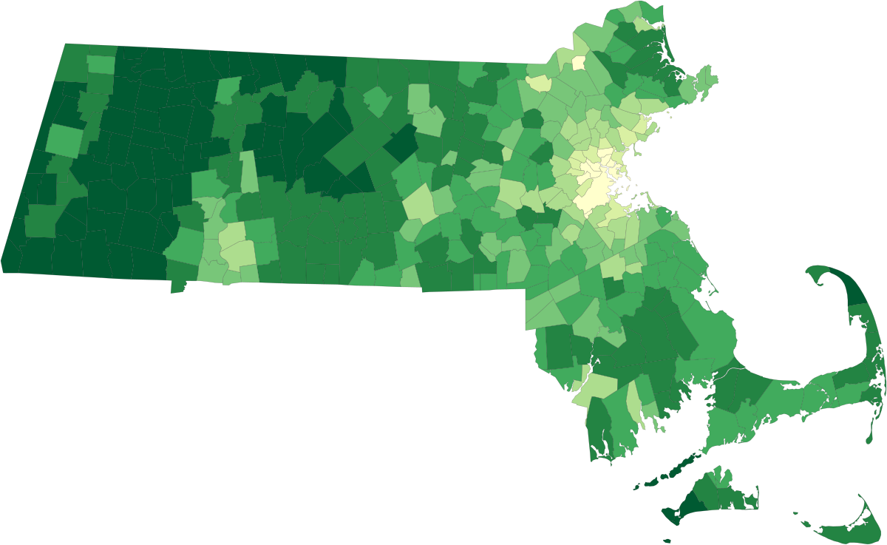

# Massachusetts Municipalities Map

Based on data from:

https://www.mass.gov/info-details/massgis-data-municipalities

First we simplify the data so it is easier to work with.

Then we add in population density as an example to start with,
and show that on a color scale. The data shown can be switched.

The essential library is [mapshaper](https://github.com/mbloch/mapshaper)
for geo file manipulation.

Color scales were picked from the wonderful colorbrewer2,
mapshaper could be used for color scales directly instead.

Note the data from Massachusetts came already projected
so it is planar to begin with.

## Getting Started

Before getting started run `npm install` to get the `mapshaper` dependency.

Quick version for 2010 data since that is what comes with mass data.

```bash
npm run data:fetch # run this once to download data and unzip it in data
npm run build:init # make geojson file from shapefile while simplifying in build
npm run build:pop2010 # adds population density to geojson data in build
npm run build:svg2010 # creates svg file and key from the geojson data in dist
```

You should be able to see locally `dist/map-2010.svg`
that should look like the following example here.


Population density (in 2010) for people / square mile by municipality.

A more involved getting started gets 2020 data from the US census and joins it.

```bash
npm run data:fetch # if already run for quick version this can be skipped
npm run build:init # this can be skipped too like the fetch if alread run
npm run data:fetch2020 # get the US census data from 2020 to join in
npm run build:pop2020 # adds population density warns on suspect data
npm run build:svg2020 # creates svg file and key from the geojson data in dist
```




Population density (in 2020) for people / square mile by municipality.

## Appendix

Inspired by:

https://medium.com/@mbostock/command-line-cartography-part-1-897aa8f8ca2c

But the tools in use in that article were not as useful as `mapshaper` is.

Colors were picked from:

https://colorbrewer2.org/

Population density breaks were investigated in:

https://vega.github.io/voyager/

Very useful command line reference for mapshaper is:

https://github.com/mbloch/mapshaper/wiki/Command-Reference
